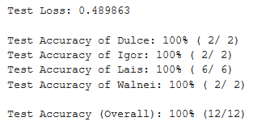
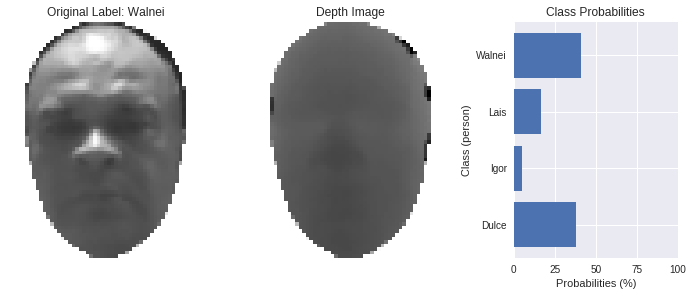

# Face recognition using depth information from Kinect sensor

This repository contains material related to the Side Project from Udacity's Pytorch Scholarship Challenge,
 made by [@marielen](https://github.com/marielen) and [@igorpaladino](https://github.com/igorpaladino). 

It consists of a code where it's possible to train a model to recognize people from their depth facial information collected by a Kinect Sensor.

# Table Of Contents

## 1. Run the Code

To run the code, please follow the instructions below.

### 1.1. Dependencies

All the code was made using Colab from Google Research. It's advisable to run in the same platform.

### 1.2. Enable GPU on Colab

If the GPU is not enabled, please follow the instructions:

` Edit -> Notebook settings -> Change runtime type and select GPU as Hardware accelerator.`

### 1.3. Download data

The zip file which contains the data is available in this link https://drive.google.com/open?id=1c9CjfJbOU2IM5e-_PpGMYRg7BpazS8uh .
It's possible to download the zip file inside Colab just using the code below.

```
my_file_id = "1c9CjfJbOU2IM5e-_PpGMYRg7BpazS8uh"
!pip install gdown
!gdown https://drive.google.com/uc?id={my_file_id}
```

Please, don't forget to unzip the zip file.

Change the variable `root_path` to your current path.

### 1.4. Access model file

The trained model will be saved on `root_path`.

## 2. Story Behind the Code

### 2.1.Idea

In Igor's final project at university, he tested the used of digital neural networks, also known as weightless neural networks,
for face recognition using color and depth information from Kinect sensor with Python. After finishing the Challenge Project they thought
that could be a good idea to take all the data that was collected from Kinect to his university's final project and use it with pretrained
neural network models from Pytorch.

This idea is pretty useful nowadays because face recognition is becoming very popular and is quite simple to get access to a
device which you don't have permission just with a photo of the owner. Using the depth facial information is not purely secure,
because someone can do a 3d model face oh the owner of the device and unlocked it. Even though it's quite hard to make this, they think that
the combination of multiple strategies to face recognition is the best.

### 2.2. Input Data

For this project, they used just the depth information as neural network input data as they were more interested in analysing
the network performance over the depth information.
Thinking about a final system for face recognition, they could use both color and depth information to recognize
different people.

The image datasets used as input were acquired using the Kinect (Xbox 360) device.
This device is composed by a conventional camera and an infrared depth sensor.

All the images were taken from a distance ranging from 80cm to 1.1m from the Kinect sensor which has a resolution of 2mm. In the image depth.


**Figure 1** - Visualization of input data.

Figure 1 is showing one sample of a 2d image and the depth for each class which is inside the dataset.

### 2.3. Model

When Marielen was developing the Challenge Project, she trained all the pretrained neural network models from Pytorch just change the number
of output from the last layer and she got the highest accuracy with `densetnet201`. Therefore, they decided to use this neural
network architecture.

### 2.4. Result
The trained model got the following results:



**Figure 2** - Performance of the densenet201 model

Even though the dataset size is not so big and there are some pictures pretty similar, it was possible to get a high test accuracy.

### 2.5. Predict


**Figure 3** - Visualization of Predict Result

In Figure 3, is showing one prediction for an image from the test dataset. In the class probabilities, it's possible to see that the model was correct in its prediction.


